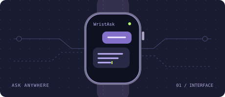
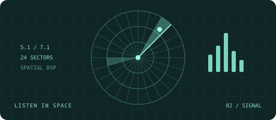
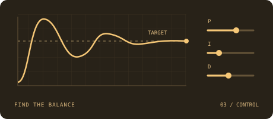
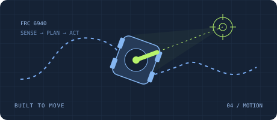

  

  <a href="#selected-work"><b>Selected work</b></a> &nbsp; / &nbsp;
  <a href="#side-quests"><b>Side quests</b></a> &nbsp; / &nbsp;
  <a href="#under-the-hood"><b>Under the hood</b></a> &nbsp; / &nbsp;
  <a href="https://github.com/inbannable?tab=repositories"><b>All repositories ↗</b></a>

 

**Hey, I'm William.** I connect software to the physical world: real-time audio, robots in motion, and small interfaces with a lot going on underneath.

I care about the signal path, the control loop, and the assumptions between input and action. This is my corner of the internet for turning those ideas into things you can use.

## Selected work

<samp>FOUR WAYS FROM INPUT TO ACTION</samp>

<table>
  <tr>
    <td width="50%" valign="top">
      
      
<samp>01 / INTERFACE · WATCHOS</samp>

      <h3><a href="https://github.com/inbannable/WristAsk">腕问 · WristAsk ↗</a></h3>
      
A small screen. A bigger conversation. An AI assistant built for your wrist.

      
<code>Swift</code> <code>SwiftUI</code> <code>watchOS</code>

      

        
<b>Follow the conversation</b>

        
Dictation, handwriting, or keyboard input → DeepSeek → streaming responses on your watch.

        
<a href="https://github.com/inbannable/WristAsk">Explore the app and source →</a>

      

    </td>
    <td width="50%" valign="top">
      
      
<samp>02 / SIGNAL · SPATIAL AUDIO</samp>

      <h3><a href="https://github.com/inbannable/EchoRadar">EchoRadar v2 ↗</a></h3>
      
See where sound comes from. Native multichannel game audio, mapped to a directional radar.

      
<code>C++20</code> <code>WASAPI</code> <code>STFT</code> <code>DirectX 11</code>

      

        
<b>Trace the signal</b>

        
Native 5.1/7.1 audio → multichannel signal analysis → a 24-sector radar. Direction comes from the channels, without inventing it from stereo.

        
<a href="https://github.com/inbannable/EchoRadar">Explore the signal path →</a>

      

    </td>
  </tr>
  <tr>
    <td width="50%" valign="top">
      
      
<samp>03 / CONTROL · SIMULATION</samp>

      <h3><a href="https://github.com/inbannable/Turret-Lab">Turret Lab ↗</a></h3>
      
Tune the loop. Watch the response. A browser lab for exploring how control systems behave.

      
<code>TypeScript</code> <code>React</code> <code>PID</code>

      

        
<b>Look inside the loop</b>

        
Compare direct PID with cascaded control using the same plant, target, and disturbance. Change the controller; inspect the response.

        
<a href="https://github.com/inbannable/Turret-Lab">Explore the simulation →</a>

      

    </td>
    <td width="50%" valign="top">
      
      
<samp>04 / MOTION · ROBOTICS</samp>

      <h3><a href="https://github.com/inbannable/2026Rebuilt-dev">Orion · FRC 6940 ↗</a></h3>
      
Keep moving. Keep aiming. Robot software that connects sensing, planning, and action.

      
<code>Java</code> <code>WPILib</code> <code>AdvantageKit</code> <code>PathPlanner</code>

      

        
<b>Inspect the moving parts</b>

        
Aiming on the move, turret control, dual-encoder positioning, vision fusion, and autonomous routines.

        
<a href="https://github.com/inbannable/2026Rebuilt-dev">Explore the robot code →</a>

      

    </td>
  </tr>
</table>

Project illustrations are conceptual. Open a card to explore its repository, or expand a note for a closer look.

 

## Side quests

<samp>SMALL RULES. UNEXPECTED OUTCOMES.</samp>

| Experiment | What's inside |
| :-- | :-- |
| **[星阵 · 3D Gomoku ↗](https://github.com/inbannable/3d-gomoku)** | Think in three dimensions. Gravity-aware 5×5×5 connect-four with a strategy AI and move coach. |
| **[Director's Cut ↗](https://github.com/inbannable/directors-cut-mc26.2)** | Controlled chaos. A server-authoritative Minecraft story director for events and hints. |
| **[Conway's Game of Life ↗](https://github.com/inbannable/Conway-Life-Game)** | Watch complexity emerge from simple rules, right in the browser. |

 

## Under the hood

Pick a channel to explore my toolkit.

  
<b>◉ &nbsp; Signal</b> — from samples to meaning

  
<code>C++20</code> <code>Python</code> <code>CMake</code>

  
Multichannel DSP, spectral analysis, and the path from raw audio to spatial information.

  
Start with <a href="https://github.com/inbannable/EchoRadar">EchoRadar →</a>

  
<b>◎ &nbsp; Control</b> — from error to action

  
<code>Java</code> <code>WPILib</code> <code>PID</code>

  
Trajectory planning, sensor fusion, and control loops that have to work in the physical world.

  
Start with <a href="https://github.com/inbannable/Turret-Lab">Turret Lab</a> or <a href="https://github.com/inbannable/2026Rebuilt-dev">Orion →</a>

  
<b>⌘ &nbsp; Interface</b> — from intent to interaction

  
<code>Swift</code> <code>SwiftUI</code> <code>watchOS</code> <code>TypeScript</code> <code>React</code>

  
Apple-platform apps and interactive simulations, from a watch screen to a browser canvas.

  
Start with <a href="https://github.com/inbannable/WristAsk">WristAsk →</a>

  

---

  <samp>OBSERVE CAREFULLY. MODEL HONESTLY. LEAVE A CLEAN TRACE.</samp>
    
  <a href="https://github.com/inbannable?tab=repositories"><b>Find your next rabbit hole ↗</b></a>
  &nbsp; · &nbsp;
  <a href="#"><samp>Back to top ↑</samp></a>

