  

I build software that listens, decides, and moves — from real-time audio and robot control to Apple-platform apps and interactive simulations. I care about the signal path, the control loop, and the assumptions between input and action.

### `01 / selected work`

<table>
  <tr>
    <td width="50%" valign="top">
      <samp>INTERFACE / WATCHOS</samp>
      <h3><a href="https://github.com/inbannable/WristAsk">腕问 · WristAsk</a></h3>
      
An AI assistant on your wrist. Dictation, handwriting, or keyboard in; streaming DeepSeek responses out.

      <samp>Swift · SwiftUI · WatchConnectivity</samp>
    </td>
    <td width="50%" valign="top">
      <samp>SIGNAL / SPATIAL AUDIO</samp>
      <h3><a href="https://github.com/inbannable/EchoRadar">EchoRadar v2</a></h3>
      
Native 5.1/7.1 game audio mapped onto a 24-sector radar. Direction from multichannel signals, without inventing it from stereo.

      <samp>C++20 · WASAPI · STFT · DirectX 11</samp>
    </td>
  </tr>
  <tr>
    <td width="50%" valign="top">
      <samp>CONTROL / SIMULATION</samp>
      <h3><a href="https://github.com/inbannable/Turret-Lab">Turret Lab</a></h3>
      
A browser lab for direct PID and cascaded control. Same plant, target, and disturbance; different control loops.

      <samp>TypeScript · React · Control systems</samp>
    </td>
    <td width="50%" valign="top">
      <samp>MOTION / ROBOTICS</samp>
      <h3><a href="https://github.com/inbannable/2026Rebuilt-dev">Orion · FRC 6940</a></h3>
      
Robot software for aiming on the move, turret control, dual-encoder positioning, vision fusion, and autonomous routines.

      <samp>Java · WPILib · AdvantageKit · PathPlanner</samp>
    </td>
  </tr>
</table>

### `02 / side channels`

- [**星阵 · 3D Gomoku**](https://github.com/inbannable/3d-gomoku) — Gravity-aware 5×5×5 connect-four, with a strategy AI and move coach.
- [**Director's Cut**](https://github.com/inbannable/directors-cut-mc26.2) — A server-authoritative Minecraft story director for events, hints, and controlled chaos.
- [**Conway's Game of Life**](https://github.com/inbannable/Conway-Life-Game) — Small rules. Emergent behavior. Runs in the browser.

### `03 / toolkit`

| Domain | Tools & interests |
| :-- | :-- |
| **Signal** | C++20 · Python · CMake · multichannel DSP · spectral analysis |
| **Control** | Java · WPILib · PID · trajectory planning · sensor fusion |
| **Interface** | Swift · SwiftUI · watchOS · TypeScript · React |

 

---

  <samp>observe carefully. model honestly. leave a clean trace.</samp>
    
  <a href="https://github.com/inbannable?tab=repositories"><samp>ls ./repositories →</samp></a>

